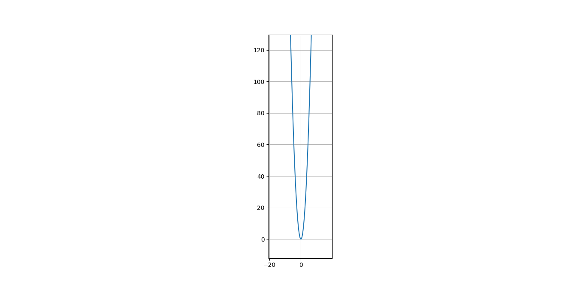

# Parte 3
## Las functiones están dadas





---

# Scripts de matplotlib

Si desean hacer este trabajo de la misma manera en sus computadores, les sugero entonces que descarguen matplotlib y numpy,
Antes que nada tienen que seguir esta estructura para tener mayor mododidad (O al menos para mí lo es)
```python
import matplotlib.pyplot as plt
import numpy as np

x = np.arange(-20, 20, 0.1)
# Contenido de la función que deseen colocar
plt.plot(x, y)
plt.axis('scaled') # Esto es para que los ejes tengan su misma proporción
plt.grid()
plt.show()
```

$ y=x^2 $
```python
y = x**2
```
$ y=x^2 +3 $
```python
y = (x**2)+3
```
$ y=x^2 -3 $
```python
y = (x**2)-3 
```
$ y=\left(x+3\right)^2 $
```python
y = (x+3)**2 
```
$ y=\left(x-3\right)^2 $
```python
y = (x-3)**2 
```
$ y=3x^2 $
```python
y = 3*x**2
```
$ y=-3x^2 $
```python
y = -3*x**2 
```
$ y=\frac{x^3}{3} $
```python
y = (x**2)-3 
```
$ y=\left(x-3\right)^2 +2 $
```python
y = ((x-3)**2)+2 
```
$ y=-\left(x-3\right)^2 +2 $
```python
y = (-(x-3)**2)+2 
```
